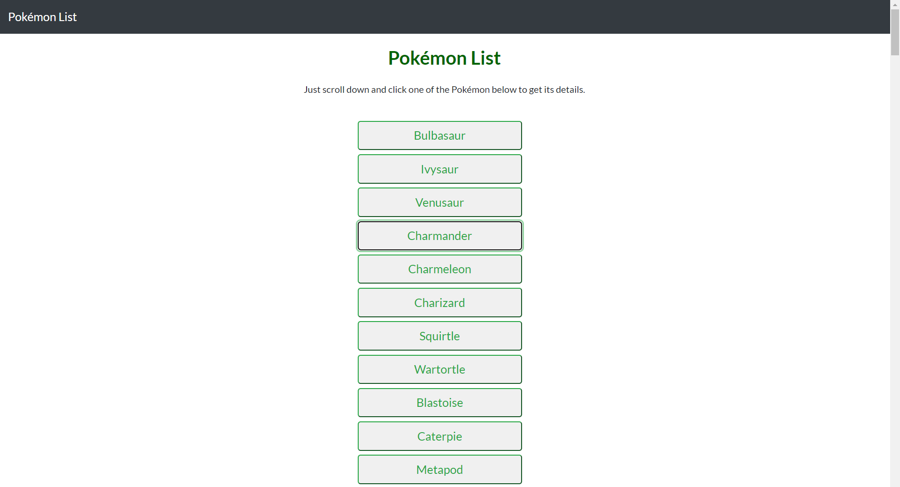
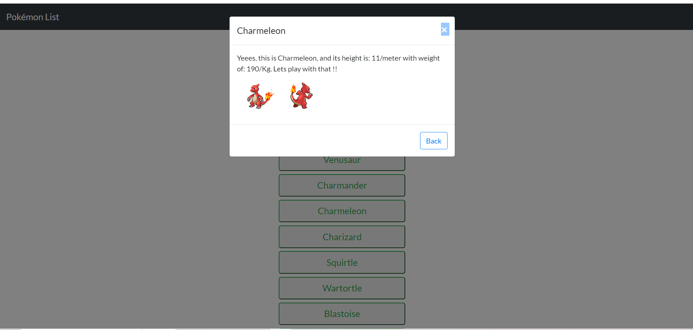

# simple-js-app

> In this project users are able to scroll and click on a Pokémon name through a list to get some info and see the pictures of chosen Pokémon.

The app will fetch data from an API .

## Built With

- Major languages,
- frameworks,
- technologies used

## Live Demo

[Live Demo Link](https://livedemo.com)
